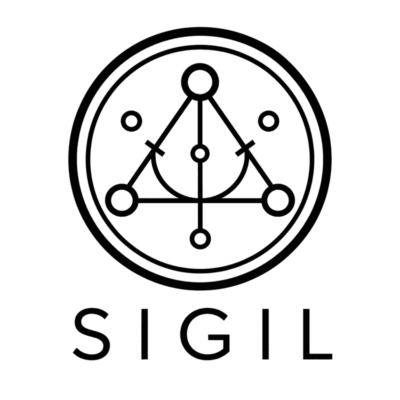

<p align="center"></p>

# Sigil

A self-hosted, stateless Bitcoin multisig coordinator.

- **M-of-N multisig** (P2WSH) — 2-of-2, 2-of-3, 3-of-5, any quorum. Built on the
  [Caravan](https://github.com/caravan-bitcoin/caravan) libraries.
- **Ledger signing over WebUSB**, plus PSBT import/export for airgapped signers
  (Coldcard, SeedSigner, anything that speaks PSBT).
- **Watch-only by design** — configured with xpubs only. Keys never touch the app.
- Multi-wallet switcher, address labels, recipient whitelist, fee selection with
  live mempool estimates, transaction history.
- No server, no accounts, no telemetry. A static bundle plus a local API proxy.

## Quick start

```bash
git clone https://github.com/bensig/sigil && cd sigil
npm install
npm start        # builds and serves locally
```

First run shows a setup screen. Create your wallet:

```bash
cp -r src/configs/example src/configs/mywallet
$EDITOR src/configs/mywallet/config.json   # network, quorum, your cosigners' xpubs
npm start
```

`npm run dev` runs the Vite dev server with HMR for development.

## Wallet config schema

```jsonc
{
  "walletName": "My Wallet",
  "network": "mainnet",            // or "testnet"
  "client": {
    "provider": "mempool",          // primary API: "mempool" | "blockstream"
    "apiBaseUrl": "",               // optional self-hosted instance URL
    "fallbackProvider": "blockstream",
    "fallbackApiBaseUrl": ""
  },
  "quorum": { "requiredSigners": 2, "totalSigners": 3 },
  "signers": [
    {
      "name": "Alice",
      "xpub": "xpub6...",           // account-level extended public key
      "xfp": "deadbeef",            // master fingerprint
      "bip32Path": "m/48'/0'/0'/2'" // account derivation path (BIP48 P2WSH shown)
    }
  ]
}
```

Optional `src/configs/wallets.json` (see `wallets.example.json`) controls wallet
ordering, display names, and accent colors; without it the registry is derived
from the config directories.

## Getting your cosigner keys

Each signer needs three things: an account-level **xpub**, the device's master
**fingerprint** (xfp), and the **derivation path** the xpub came from. For
multisig, use the BIP48 P2WSH path: `m/48'/0'/0'/2'` on mainnet,
`m/48'/1'/0'/2'` on testnet.

- **Ledger:** easiest is from inside Sigil — open the **Config** tab, connect
  the device, and use *Export xpub from Ledger* on the signer row; it fills the
  xpub for the configured path. The master fingerprint is shown by most wallet
  tools (e.g. Sparrow's device dialog), or derivable from the device's root key.
- **Coldcard:** `Settings → Multisig Wallets → Export XPUB` (or read
  `ccxp-*.json` from the SD card) — it includes the `p2wsh` xpub for the BIP48
  path and the `xfp`.
- **SeedSigner / other airgapped devices:** use the device's multisig xpub
  export (usually shown as a QR containing xpub + fingerprint + path).

Every cosigner uses the **same path** in a standard setup; the order of the
`signers` array doesn't matter for address derivation (keys are sorted per
BIP67), but keep it consistent across coordinators.

## Saving from the UI

Address labels, the recipient whitelist, and config edits made in the UI are
written back to `src/configs/` and `src/data/` by the local server. This works
under `npm start` and `npm run dev` — **not** on a static deploy, where the app
is read-only. Config edits require a restart of `npm start` to take effect.

## Security model

- The app holds **no keys**. It builds and coordinates PSBTs; signatures come
  from your hardware devices.
- **Your xpubs are baked into the built bundle.** Anyone who can fetch the
  bundle can derive every address and see every balance. Run it locally, or
  deploy only behind authentication you trust. Never host a configured build
  publicly.
- The example config's keys are published in this repo. Never send funds to it.

## Deploying

See [docs/deploy.md](docs/deploy.md) for static hosting (Netlify / nginx) with
the required API proxy rules.

## License

MIT — see [LICENSE](LICENSE). Built on Caravan by Unchained Capital and contributors.
